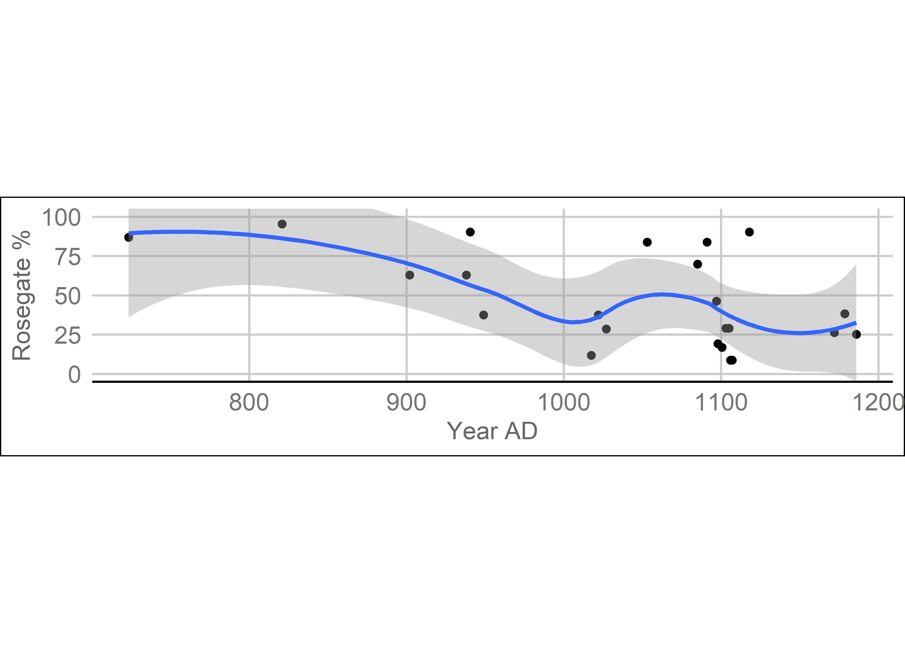

```{r setup, include = F}
knitr::opts_chunk$set(echo = F,warning = FALSE, message = FALSE,
                      fig.align = 'center', out.width = "6.26in")
library(tidyverse)
library(magrittr)
library(rio)
library(textreadr)
library(kableExtra)
library(huxtable)
captions <- read_docx('Rosegate Tables and Figures.docx') %>% 
  stringr::str_remove_all('Table [0-9]. ') %>% 
  stringr::str_remove_all('Figure \\d. |Figure \\d\\d. ')
```

# Introduction

Archaeologists working in the Fremont region have benefited for decades from a standard projectile point typology established in the 1980s (Holmer and Weder 1980; Holmer 1986). Numerous excavations have since occurred, and a wealth of new projectile point data and absolute dates are now available. Given this new data, we believe it is time for a general review of Fremont projectile point types; however, this study is limited to two questions we argue are in particular need of addressing: (1) how long do Rosegate points persist in the Fremont region, and (2) should Rosegate points should be considered separately as Rose Spring Corner-notched and Eastgate Expanding-stem (hereafter Rose Spring and Eastgate)?

The chronology is of particular importance, as Fremont dating is poorly developed, especially when compared to the high-resolution tree-ring and ceramic chronologies used in adjacent areas of the Southwest. Many Fremont ceramic types are sufficient only to identify a site to the Fremont period (see Madsen 1977), which places additional importance on the use of projectile points as chronological markers. Rosegate projectile points (see Figure 1 for examples) are commonly found at Fremont sites in the eastern Great Basin and Colorado Plateau. They appear to be the earliest projectile points associated with the bow and arrow, which was introduced to the area sometime between AD 1 and 600 (Heizer and Baumhoff 1961:128; Hester 1973:126; Holmer 1986:107; Lanning 1963:249,252). Holmer and Weder (1980:60; also Holmer 1986:107) state that Rosegate points are found until AD 900-1000. This contrasts with the central and western Great Basin where these points are known to date up to AD 1300 (Thomas 1981:19). Justice (2002) lists the end date for Rosegate throughout the Great Basin as AD 1300 in his review of Great Basin projectile points, although the sites he discusses in the Fremont region are primarily cave sites, which may differ from villages and hamlets. Several other researchers have commented on the late persistence of Rosegate points in Fremont sites (e.g., Aikens 1970:56; Baadsgaard and Janetski 2005:135; Berry 2005:749; Talbot et al. 1999:109; Wilde and Soper 1999:102); however, these discussions are in the context of individual sites and Holmer and Weder&#39;s dates are still commonly cited in Fremont literature. Various other point styles, most commonly small side-notched points, appear between AD 900-1000 throughout the Fremont region and are argued to have replaced Rosegate points (Holmer and Weder 1980; Holmer 1986). This coincides with the corner-notched to side-notched transition in the rest of the Southwest (Whittaker and Bryce 2017:635), and in the Central Plains (e.g., Hughes 2017), which makes this a relevant topic macro-regionally as well. While Rosegate points clearly decline in relative abundance through time, our investigation using projectile point data from 22 sites indicates that they are relatively common until the end of the Fremont period. We argue these points should be used as indicators of a pre-AD 1000 date only in large assemblages that contain no other arrowpoint styles. A spatial analysis of the data indicates Rosegate points are also widespread in the Fremont region after AD 1000.

```{r figure 1, fig.cap=captions[7]}

```

Whether Rosegate points should be discussed as two separate types is less critical than the chronology, but several approaches are in common use and a clearer understanding of how the two types are related may generate greater uniformity in intersite syntheses. The relatively recent adoption of geometric morphometrics in archaeology provides an opportune method for investigating this question (see Cardillo 2010; MacLeod 2017; Mitteroecker and Gunz 2009; Okumura and Araujo 2019; Shott and Trail 2010). The field of geometric morphometrics has grown rapidly since its primary origin in the early 1990s in biology and is now a mature field (Adams et al. 2013; Bookstein 1991; Corti 1993; Mitteroecker and Gunz 2009; Rohlf and Marcus 1993). Geometric morphometrics can be used to analyze shape data using coordinates or outlines on 2D or 3D data (Rohlf and Marcus 1993), and has been used to analyze projectile points in a growing number of studies (e.g., Buchanan and Collard 2010; Charlin and González-José 2018; Davis et al. 2017; Fisher 2018; Fox 2015; Okumura and Araujo 2015, 2016; Selden et al. 2020; Shott and Trail 2010; Smith et al. 2015; Thulman 2012). Our analysis found this approach useful for distinguishing between different types of points, although projectile points current defined as Eastgate and Rose Spring could not be easily separated.

In the remainder of this paper, we briefly review the Fremont and Rosegate projectile points before using the accumulated projectile point dataset in combination with a radiocarbon database compiled for this study to address the persistence of Rosegate points. We also examine the spatial distribution of Rosegate points in this study and Rose Spring data collected by Holmer and Weder (1980) to examine whether Rosegate points are spatially clustered. We use Rosegate illustrations and photographs from eight Fremont sites to examine Rosegate morphology using methods from geometric morphometrics. We also discuss future directions for projectile point research in the Fremont region.

# The Fremont

Definitions of Fremont diverge, but, by any definition, most Fremont people were small-scale horticulturalists relying on a mixture of maize and other cultigens, as well as wild resources (see the following for recent summaries Allison 2015; Simms 2008). The Fremont can be considered an archaeological culture region and a period, dating primarily from approximately AD 700-1300. The Fremont region comprises much of what is now the state of Utah, north of the Virgin and Colorado rivers, as well as bordering states. Fremont populations reached their peak and greatest spatial extent between ca. AD 1000-1300 (Talbot 2000:278). The end of horticulture in the region, and thus the end of the Fremont period, is approximately AD 1300 (Allison 2010). Many characteristics are reminiscent of neighboring cultures in the Southwest, but distinctive rock art, moccasins, basketry, figurines, and a handful of other traits distinguish the Fremont from their neighbors to the south (Talbot 2000).

# Rosegate Background

The standard projectile point typology for the Fremont region was developed by Holmer and Weder in 1980. Some of the dates were slightly modified by Holmer (1986)— Rosegate points are extended to AD 1000 from the AD 900 date given in the original Holmer and Weder publication. Justice (2002) also reviews Rosegate points, which he terms a cluster including separate Rose Spring and Eastgate types, but his discussion of projectile points focuses primarily on the California and west/central areas of the Great Basin. He particularly does not discuss the dating discrepancy between the western Great Basin and eastern Great Basin listed by Holmer (1986). Justice also groups Rose Spring and Eastgate into a single category termed Rosegate following Thomas (1981:19; see Holmer 1986:107). One argument for differentiating the types is that, according to Holmer and Weder (1980:60), Eastgate points are only found in the Great Basin, while the distribution of Rose Spring points is widespread. Justice (2002:333–336) notes a wider distribution of Eastgate points than Holmer and Weder do, but much of the Fremont region is still not included (see Figure 2). Some archaeologists use Rose Spring and Eastgate as initially defined by Holmer and Weder, while others use a hybrid approach with three categories: Rose Spring, Eastgate, and Rosegate, reserving the latter term for ambiguous points that clearly belong to the Eastgate/Rose Spring morphological continuum but are difficult to classify definitively as one or the other.

```{r figure 2, fig.cap=captions[8]}

```

Rose Spring points were initially defined at the Rose Spring site in California by Lanning (1963) and are distributed throughout the Great Basin, the Colorado Plateau, and surrounding areas (see Justice 2002:320–330). They are corner-notched and are typically long and slender. Eastgate points were defined from excavations at Wagon Jack Shelter in Nevada by Heizer and Baumhoff (1961) and are generally restricted to the Great Basin (Justice 2002:330–336). They have deep parallel notches in the base that create barbs extending from the blade. Holmer (1986:107, Figure 16) dates Rosegate points from ca. AD 300 to AD 900-1000. This contrasts with the central and western Great Basin where these points are known to date up to AD 1300 (Thomas 1981:19). Holmer (1986:107) cites the western edge of the Fremont as a boundary for Rosegate points after AD 900-1000. He does note that this is not an absolute chronological boundary, as some Rosegate points were found in Evans Mound, which dates after AD 1000. Holmer (1986:107) and Holmer and Weder (1980:60) state that Rosegate points were replaced by a variety of later Fremont point types, which include side-notched, basal-notched, and concave-based points. These later points are commonly found until the end of the Fremont, ca. AD 1300, when they are replaced by Desert series points.

# Rosegate Chronology

Our interest in the Rosegate chronology was sparked by excavations at Wolf Village, located at the south end of Utah Valley. This site has nine excavated structures and an unusually large assemblage of artifacts for the Fremont region (Johansson et al. 2014; Lambert et al. 2016). An early occupation (Wolf Village 1 in figures) most likely dates to the late AD 600s. A total of 61 projectile points were found associated with two activity areas dating to the early occupation (Lambert et al. 2016). Of the 61 projectile points found in these areas, 87% (n = 53) are Rosegate points; almost all the other points are either dart points or indeterminate points. The one exception is a Nawthis side-notched point that was found immediately below the modern surface, and probably dates to the later occupation of the site (Wolf Village 2 in figures). The lack of other Fremont projectile point types fits the expected chronology and matches the radiocarbon dates. However, 137 Rosegate projectile points were found in later contexts, comprising 19% of all projectile points from the later occupation. Radiocarbon and tree-ring dates place this occupation between the mid AD 1000s and early 1100s (Johansson et al. 2014:35; Lambert 2018:41). No early dates were obtained from these areas, and none of the structures are superimposed over substantially earlier occupations. The Rosegate points were mostly found associated with floors or the fill of the structures and were found in association with other point types. These Rosegate points are not associated with any evidence for an earlier occupation, and the associated assemblages all appear to date at least several decades, and possibly more than a century, after AD 1000. The initial analysis of projectile points was based on Holmer and Weder&#39;s chronology, which suggested the presence of Rosegate points in the later assemblages was anomalous and led to the questions we address in this study.

In order to determine whether Rosegate points are commonly found after AD 1000 in other Fremont sites, we assembled a database of 21 sites containing 5,744 projectile points and 1,707 Rosegate points (Table 1; Figure 3 displays site locations). The sites included are a subset of excavated Fremont sites. We first looked for sites in Utah Valley, close to Wolf Village, and then expanded our search to other Fremont sites. We concentrated on sites with a large number of analyzed projectile points. We also primarily looked for reports that used Holmer and Weder&#39;s typology, to better maintain consistency in the data. Because we are primarily interested in the relationship of Rosegate points to other points associated with the bow and arrow, we calculated percentages of Rosegate points to the total number of arrow points. We removed all point types usually associated with the Archaic period, or more accurately with the atlatl. Small numbers of these points were found at nearly every site. Hildebrandt and King (2012) outline a convenient method of discriminating between dart and arrow points by adding the neck width and maximum thickness. This method was used as a general, but not absolute, guideline for the Wolf Village points, as well as for points from recent excavations at the Hinckley Mounds site in Provo. When working with published data from other sites, we assigned points as dart points based on the reported type. There are likely a few errors in assigning points to arrows or atlatl darts, but this distinction is important in this study as some sites—particularly caves—had long occupations that often predate the arrival of the bow and arrow; thus, removing dart points provides a more accurate picture of how common Rosegate points are versus other arrow points in the assemblages. Percentages stated below are based on the number of Rosegate relative to the total number of arrow points.

```{r figure 3, fig.cap=captions[9]}

```

To evaluate the chronology, we compiled a database of 218 radiocarbon dates from published sources and new dates (see supplemental table). We also compared the dates with the chronological estimates given by the authors of each report to ensure contextual information and other dating methods did not affect the analysis. Dates were calibrated using the intcal20 standard (Heaton et al. 2020) and converted to calendar years using the Bchron package (Haslett and Parnell 2008) in R (R Core Team 2020). Many older radiocarbon dates suffer from the well-known old-wood problem common in Fremont archaeology (Allison 2016), thus, where possible, we focused on more recently taken dates from annual plants (mostly maize), including a number of previously unpublished dates.

```{r table 1}
t1 <- import('Rosegate Table 1.xlsx') %>% 
  slice(-24,-25)
a <- 
  '$^a$Bull Creek incorporates several site numbers: 42WN226, 42WN230, 42WN231, 42WN261, 42WN326, 42WN337, 42WN991, 42WN996.'
b <-  
  '$^b$This site is composed of several mounds that were excavated and reported at different times.'
t1 %>% 
  kable(booktabs = T, caption = captions[2],
        escape = F) %>%
  kable_styling(latex_options = c("repeat_header"), font_size = 10) %>%
  landscape() %>% 
  column_spec(column = 5:6,width = '10em') %>% 
  footnote(c(a,b),escape = F)
```

Figure 4 shows the distribution of dates, which peaks at around AD 1100. Figure 5 shows the sites in this study arranged chronologically according to median radiocarbon date. Medians of the dates on annual plants are depicted separately from the median of all dates, although for most sites the annual plant dates are not significantly different—Backhoe Village being the primary exception. Most sites have median dates after AD 1000, but each site contains Rosegate projectile points. Figure 6 shows the median dates compared to the Rosegate percentage at each site. There is a clear decline over time, but the decline slows at around AD 1000, and the loess smoothing line (see Cleveland and Devlin 1988) never dips below 25%. A linear regression of this data returns an adjusted _r__2_of 0.31 (_F-statistic_ = 9.7_, df_ = 22_, p =_ 0.01). Rosegate points do decline over time, but they cannot account for most of the variation in dating for these sites.

```{r figure 4, fig.cap=captions[10]}

```

```{r figure 5, fig.cap=captions[11]}

```

```{r figure 6, fig.cap=captions[12]}

```

To simplify the chronology, we have divided the sites into early and late periods for some analyses. Sites dating before approximately AD 1000 are defined as early, and sites dating after this period are defined as late. Several sites did not have accurate enough data to easily separate the assemblages, or the date ranges significantly overlap the early and late periods and cannot be confidently assigned to one or the other. A conservative approach was taken when assigning sites to periods and most sites were placed in the mixed category. Even in sites confidently assigned to the late period, Rosegate percentages ranged as high as 46% and were never lower than 9% (see Table 2 for percentages by period and Figure 7 for all site percentages).

```{r figure 7, fig.cap=captions[13]}

```

```{r table 2}
t2 <- import('Rosegate Table 2.xlsx')
names(t2)[1] <- ' '
t2 %>% 
  kable(booktabs = T, caption = captions[3]) %>%
  kable_styling(font_size = 10,full_width = F, position = "center")
```

Only three sites in the dataset are assigned to the early period: Mosquito Willies, Lost Ridge, and the early component at Wolf Village. Rosegate points make up 94% of the combined projectile point assemblages from these sites. Most of the other points are undetermined points that are either too fragmented to classify, or else represent uncommon or untyped variants. The high percentage of Rosegate points for these sites substantiates the current view that Rosegate points are the earliest arrow points in the Fremont region. The sample size in this dataset is small, but no other arrow points are known to be produced in this period.

Nine sites clearly date primarily to the late period. The percentage of Rosegate points drops to 23% in the combined late assemblages, but with considerable variation between sites. The South Temple site has the highest percentage of Rosegate points in this period at 46%, but the Kay&#39;s Cabin site only has 9%. Notably, several late sites have large numbers of Rosegate points; Baker Village has the most with 142 out of 539 points (26%).

Most of the sites could not clearly be dated entirely after or before AD 1000. Rosegate points comprise 34% of points from the sites assigned to the mixed category. Long or multiple occupations, such as American Fork Cave, are one cause of dating problems, but in many cases, the radiocarbon error range is too large to rule out earlier dates. Allison&#39;s (2016, 2019) analysis of radiocarbon dates indicates that Fremont populations rapidly increased starting at about AD 1000 and it is probable that most of the points in these sites date after the presumed end of Rosegate points. Regardless, the sites that clearly date after AD 1000 have too many Rosegate points to be attributed to the curation of old points.

Some sites have widely differing radiocarbon dates and one possible explanation for the occurrence of Rosegate points in apparently late assemblages at these sites is mixed stratigraphy. But Rosegate points have been found on structure floors postdating AD 1000 at Wolf Village, Woodard Mound (Richens 1983:72), Five Finger Ridge (Talbot et al. 2000:Table 6.24), Paragonah (Woods 2009:Table B.3), and other sites. While no provenience is necessarily conclusive, close association with a use-surface is usually a good indication that the artifact was used by the occupants of the structure. Far more Rosegate points are found in the fill of structures than in floor contexts, but these points are often mixed with other projectile point types, and we find it improbable that the fill of these structures is commonly composed of a thoroughly mixed combination of older and later artifacts. Rosegate points clearly continue to be used until the end of the Fremont period, although Rosegate points appear to be in the minority compared to other types in post-AD 1000 assemblages.

# Spatial Distribution

Several late styles of projectile points have strongly patterned spatial distributions across the Fremont world. For instance, Uintah Side-notched points are common in northern Utah, while Parowan Basal-notched points are common in the southwestern part of the Fremont region (and adjacent Ancestral Pueblo areas), and Bull Creek points are only common in the southeastern part of the region (and adjacent parts of Ancestral Pueblo territory; Holmer and Weder 1980:57). Though Rosegate points were not replaced by other points, perhaps there is spatial patterning in their relative abundance in various late Fremont sites.

Figure 8 shows the percentages of Rosegate points for the sites used by Holmer and Weder (1980:Table XIV) combined with the new data discussed in this study. Sites that date entirely before AD 900 have been removed for clarity, although some of the remaining sites have long or multiple occupations that begin before 900. Sites in southern Utah generally have lower Rosegate percentages than most Fremont sites, as do several sites northeast of the Great Salt Lake. The most distinct concentration of sites with high Rosegate percentages is along the Sevier River in central Utah. Several of the sites in this area have percentages of Rosegate points above 50% (Backhoe Village, East Fork Village, Pharo Village, and Hunchback Shelter), although the early components of these sites may contribute to the high values. Sites along the margins of the Fremont region in Colorado, Nevada, and near the Utah/Nevada border, also have relatively high percentages of Rosegate points, as do a few sites in the Salt Lake and Utah valleys. We initially suspected that Utah Valley sites would have high percentages of Rosegate points based on the number of these points found at Wolf Village; however, the sites in Utah Valley that date exclusively after AD 1000 have some of the lowest percentages of Rosegate points in our dataset. Each of the sites in the late period is below average for other sites in the period (Kay&#39;s Cabin, Hinckley Mounds, Woodard Mound, and the late occupation at Wolf Village). Most of the sites along the Utah/Nevada border and west of the Great Salt Lake (Swallow Shelter, O&#39;Malley Shelter, and Hogup Cave) are caves or rock shelters that have long depositional histories, which may explain the higher percentage of Rosegate points in these sites, although possibly percentages of Rosegate points are high because they have a stronger connection to groups further west.

```{r figure 8, fig.cap=captions[14]}

```

It is notable and surprising that all of the sites in this analysis that lack Rosegate points are found in Holmer and Weder&#39;s data. This is perhaps because they did not include Eastgate points alongside the Rose Spring data, although their brief discussion of Eastgate points notes they are only commonly found in the northwest quarter of the Fremont region (Holmer and Weder 1980:60), which would not affect the sites outside this area. Overall, our spatial analysis demonstrates that Rosegate points are widespread throughout Fremont territory, but tend to be most common in certain parts of the region, especially in the Sevier River Valley.

# Rosegate Morphology

Our intent in this section is to explore the gradation between Rose Spring and Eastgate points using geometric morphometric (GM) landmark analysis. We used published illustrations and photographs from seven sites (see Table 3), as well as unpublished photographs from Wolf Village. We included points typed as Rosegate, Eastgate, Parowan Basal-notched (hereafter Parowan), and unclassified side-notched points. The inclusion of the Parowan and side notch points is used as a control to test how well this analysis can discriminate between types. Parowan points are most commonly found in the southwestern Fremont region and bordering areas, and are morphologically similar to Rosegate points but with basal notches instead of corner notches (see Holmer and Weder 1980). In GM, landmarks are specific locations on each object that correspond to features on other objects. Projectile points have some features that correspond between different types (such as tips and corners), but here we use semi-landmarks. Semi-landmarks are evenly spaced points along an edge or other feature and are often used on object outlines (Bookstein 1997). The semi-landmark coordinates must be aligned prior to further analysis. Generalized Procrustes analysis (GPA), developed by Gower (1975) and later adapted for GM by Rohlf and Slice (1990), is a way to rotate, scale, and align a series of landmarks. GPA-based analysis is one of the most commonly used GM methods used in archaeology (see Okumura and Araujo 2019 for examples and cautions). The aligned coordinates can be used in standard multivariate statistical analyses.

```{r table 3}
import('Rosegate Table 3.xlsx') %>% 
  kable(booktabs = T, caption = captions[4]) %>%
  kable_styling(font_size = 10,full_width = F, position = "center")
```

A potential problem for projectile point analyses and typologies is the modification of a point throughout its use-life. The term retouching describes modifications to a stone tool after its initial shaping (Whittaker 1994:19). Retouching is generally done to increase the sharpness of the blade, although these modifications can sometimes affect the typology of the point (e.g., Bamforth 1991; Gardner and Verrey 1979; Larick 1985). However, experiments indicate this is rarely a problem for small arrowpoints. Loendorf and colleagues (2019) conducted an experimental study of arrowpoints, comparable to Rosegate points, and found that the breakage patterns and decline in performance for reworked points make these points unlikely to be affected by reworking. Notably, attempting to rework points resulted in unusual morphologies rarely or never found in the archaeological record. We elected to focus our analysis on the base, as base shape is usually the primary discriminant between types (Justice 2002) and does not seem likely to be affected by reworking. This has the added bonus of increasing the sample size as many points are damaged at the tip or along one side and must be discarded in an analysis considering the entire outline.

Landmarks are usually added manually, but this means landmarks can be subjective and subject to human error. Instead, we automated the process to create semi-landmarks using the R statistical language (R Core Team 2020) and the Momocs package (Bonhomme et al. 2014). The R script used to process the images is publicly available (see data availability statement), but we briefly describe the process here. Each image is converted to a matrix of points representing the outline of the projectile point. These matrices are aligned and centered and then the upper half of the point and the left half of the point are removed (see Figure 9). This leaves a corner of the projectile point to be used for the landmarks. The remaining coordinates are then sampled so that an equal number of coordinates remain for all projectile points, which is required for GPA. We chose 35 as this is the approximate average number of points remaining after the removal of the other points. GPA and principal components analysis were then applied to align and transform the coordinates into principal component vectors.

```{r figure 9, fig.cap=captions[15]}

```

Figure 10 shows the first two principal components, as well as the morphospace, which demonstrates the relationship between the principal components scores and the shape of the outlines. Side notch points and Parowan points are mostly separated from Rose Spring and Eastgate, although one point originally classified as Parowan appears to be misclassified. Rose Spring and Eastgate are, however, mostly overlapping.

```{r figure 10, fig.cap=captions[16]}

```

Using linear discriminant analysis (LDA) on the PCA results allows us to test how accurately the original typologies can be reproduced using this analysis. While true training and validation sets were not used in this small experiment, this provides a sense of how a GM approach compares to traditional methods. Table 4 shows the results of the predicted types using LDA and the original classification. The accuracy overall was 84% (n = 193). Each type had over 90% accuracy, except Eastgate which was 62%. The combination of Rose Spring and Eastgate into a Rosegate category would eliminate much of the error and increase the accuracy rate to 93%. The question remains, can Rose Spring and Eastgate points be reasonably separated or should they be considered one type?

```{r table 4}
t4 <- import('Rosegate Table 4.xlsx')
t4 %>%
  as_hux() %>% 
  set_contents(1,c(1,2,4:7),'') %>% 
  merge_cells(1,3:7) %>% 
  merge_cells(3:nrow(t4),1) %>% 
  set_contents(3:nrow(t4),1,'actual type') %>%
  set_align(1, 2:ncol(t4), "center") %>% 
  set_bold(1, 2:ncol(t4)) %>% 
  set_bold(2:nrow(t4), 1) %>% 
  set_rotation(2:nrow(t4), 1,90) %>%
  set_top_border(1, everywhere) %>% 
  set_right_border(2:nrow(t4)+1, 1) %>% 
  set_bottom_border(nrow(t4)+1, everywhere) %>% 
  set_bottom_border(1, 3:7)
```

Rose Spring and Eastgate points appear to lie along a continuous spectrum of morphological variability, but difficulty separating them may also be due to analyst error or to definitional error. The PCA plot does little to separate these two types, although the LDA analysis does a better job. Uniform manifold application and projection (UMAP) is a relatively recent algorithm for reducing dimensionality (McInnes et al. 2020). We use the algorithm as implemented through the &quot;umap&quot; package in R (Konopka 2020). The PCA results from the GPA analysis were used as the input for the UMAP algorithm and a K-means cluster analysis was used to create two groups. Figure 11 shows the results of this analysis. The K-means clearly only used one axis to separate the types. The group 2 points on the right-hand side would better fit group 1, but overall this analysis produced a u-shaped distribution with some separation between the two groups. The original types, however, are not well separated.

```{r figure 11, fig.cap=captions[17]}

```

This analysis suggests that Rose Spring and Eastgate cannot clearly be distinguished. Certain specimens are more clearly Eastgate or Rose Spring using the current definitions, but many points cannot be discriminated with reasonable certainty. Typologies are something we construct as necessary to make interpreting variation easier, but the difficulty of separating these types arguably supports the use of the combined Rosegate type, unless a particular research question requires a finer-grained distinction. If the types were to be redefined using a GM approach, then we would recommend a larger sample size and a more refined clustering approach.

# Projectile Points and Identity

The persistence of Rosegate points raises additional questions that may serve as profitable avenues for future research. Of particular interest is how projectile points relate to identity, and what projectile points may add to our understanding of Fremont history. Projectile points are often used as markers of social identity by archaeologists. Ethnographic research confirms this association (e.g., Clark 2001:6–22; Garfinkel 2007; Wiessner 1983). This identity is caused either by an association between an identifiable point form and a self-identified social group or because individuals learned knapping in the same communities of practice (Lave and Wenger 1991; Wenger 1998). For example, the !Kung Bushmen used projectile points as markers of identity (Wiessner 1983). However, projectile point styles often seem to cross archaeologically defined borders (Holmer and Weder 1980:67–68; Simms 1990:4), which complicates the use of projectile points as markers of identity. Jones (1994:73) points out that the widespread distribution of Rosegate points indicates the makers likely did not share ethnicity or language.

Nevertheless, artifacts do not have to be specific to only one social group to be used to mark identity. For example, Curta (2007:174) notes that medieval brooch styles in Hungary differ between the east and the west: eastern style brooches resemble brooches in Italy, whereas western brooches resemble styles in Germany and France. Thus the brooches are related to Hungarian identities but are not exclusive to Hungary. A recent study found that the distribution of projectile point types most likely corresponds to the area covered by speakers of a group of related languages, rather than any smaller social unit (Buchanan et al. 2019), thus recognizable ethnic groups would probably be too small to have a unique style. In summary, projectile point types likely reflect social identity at some level, although the association may be quite broad and may cross the social boundaries of smaller units.

If projectile points can be used as markers of Fremont identity, then perhaps the introduction of various new point types sometime between AD 800 and 1000 may represent an influx of people from other regions (Allison 2019; Janetski 1993; see Madsen and Simms 1998 for a general discussion of Fremont origins). The number and size of sites dating after this period are significantly higher than before and likely indicates that at least some migration occurred.

Projectile points have been used previously to argue for migration in the Fremont region. For example, Holmer and Weder (1980:68) cite several arguments using projectile point types for the movement of people from the Plains and Ancestral Pueblo regions. They argue that the projectile point data in their analysis support both hypotheses. Many have emphasized a local origin for the Fremont, and the Rosegate data may be an indicator of local continuity. Because Rosegate points are never replaced but continue to be manufactured and used until the end of the Fremont period, these points may be representative of descendants of Great Basin Archaic peoples whose ancestors had long inhabited the Fremont region. The spatial analysis suggests that some areas had much higher or lower percentages of Rosegate points than would be expected if the points were distributed evenly. Areas with high percentages of Rosegate points may be places where in-migration was less frequent. This explanation is appealing but tentative, as Rosegate points and similar points are widespread, including in the Southwest.

# Conclusion

Almost one in four projectile points from Fremont sites dating after AD 1000 is a Rosegate point, indicating that these points were still manufactured and used alongside other point types. We are not the first to suggest this; for example, long before the current typology was developed, Wormington (1955:109) stated that corner-notched points were never completely abandoned. It is, however, likely that Fremont sites with a large number of Rosegate points and no later point types do date early in the Fremont period, although this interpretation should be made cautiously. The modest GM study conducted here demonstrates a significant overlap between Rose Spring and Eastgate points. Given that the term Rosegate has long been in common use, we recommend continued use of the term Rosegate for future studies. We do find Justice&#39;s use of clusters and types to be a valid construct and a good alternative classification. While types are a useful analytical construct, GM techniques provide a method to move beyond simple typologies. These methods provide continuous variables that can demonstrate how closely related forms are and are a useful way to gauge the similarity between projectile points and point assemblages. These methods are adaptable and the analysis we conducted requires only a photograph or illustration of each projectile point. The application of GM methods to a regional study of Fremont projectile points will likely provide a number of insights into social relations between different areas.

**Acknowledgments.** We gratefully acknowledge Michael Searcy and David Yoder for providing unpublished projectile point data from Hinckley Mounds and Joel Janetski for providing what was at that time unpublished data for Kay&#39;s Cabin. We also thank Joel Janetski, Lane Richens, and Dennis Weder for their helpful ideas and comments and the many individuals who contributed to the excavation, analysis, and publication of the data used in this study.

**Data Availability Statement.** All unpublished data is held at the Brigham Young University Museum of Peoples and Cultures and can be obtained by contacting the authors in order to protect site locations. Non-location data, R code used in this study, and a bibtex file of citations included in this paper are available [here](https://osf.io/3ufte/?view\_only=9690c4b8ee2e4cc9b9b0251f98d48dd1).

# References